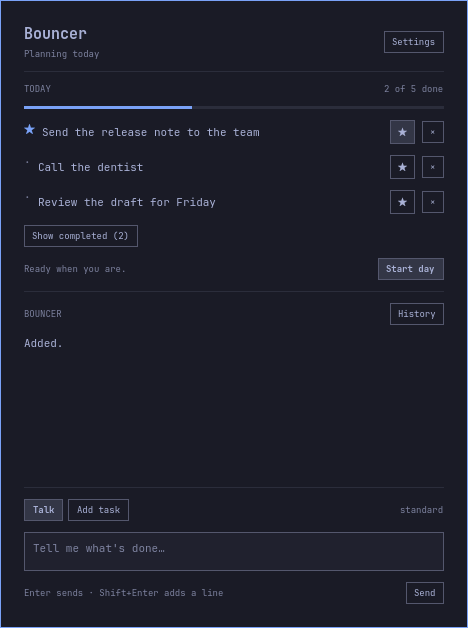

# Bouncer

A to-do list for Omarchy that keeps you focused. Bouncer stands between you and your distracting sites and apps, and nobody gets in until you've done what you said you'd do today.

In the morning you tell it what you're working on. During the day you tell it what's finished, and it checks for itself before ticking anything off: it reads the code, opens the file, looks at the link. When the list is done, you get YouTube back.

If this plug-in helps you stay focused and productive, please give it a star and pass it on. https://ko-fi.com/bennetmc



## Install

You'll need Omarchy 4, Python 3.11 or newer, and a coding agent you're already signed in to. Claude Code, Codex, Grok Build and OpenCode all work.

```sh
omarchy plugin add https://github.com/BennetMC2/omarchy-focus --enable
ln -sf ~/.config/omarchy/plugins/local.focus/focusctl ~/.local/bin/focusctl
omarchy restart shell
```

Then click the Bouncer icon in the bar. It asks which sites and apps waste your time and sets everything up from there. You'll get one password prompt, which installs a small helper so the blocks hold in every browser, and it adds its own extension to Chromium and Brave. Restart your browser when it's finished.

If something isn't working, run `focusctl doctor` and it will tell you what's missing. (The command is still called `focusctl`, from when this was Omarchy Focus.) Codex, Grok and OpenCode need `bubblewrap` installed, and so does checking Git repos. Screenshots use `grim`, and pasting an image uses `wl-paste`.

## A day with it

Open the card from the bar icon. Enter sends, Shift+Enter gives you a new line, Esc closes it.

Start by telling it your day, something like "emails, call mum, ship the importer". If you'd rather skip the chat, hit **Add task** and type one task per line. Press **Start day** once the list looks right.

When something's finished, say so: "done with the importer, it's in ~/Projects/importer". It will ask before reading that folder, have a look, and pass or fail the task with a one-line note. For things it can't see, like a phone call, it asks what happened.

You can change things by asking. "Block reddit too", "drop the dentist one" and "go hard today" all do what you'd expect. From a terminal, or from another agent, `focusctl say "..."` does the same job.

If you open something that's blocked, you get a full-screen ACCESS DENIED and then the card. While you're locked, your window borders go red and a thin strip under the bar shows your main task. Both can be turned off; just ask.

## How strict it is

There are four modes. You can go stricter at any point in the day, but you can only ease off before the day starts.

| Mode | What it takes to pass a task | What else changes |
|---|---|---|
| honor | Your word, in a line. | Emergency unlock whenever you like. |
| standard | It checks what it can see. For the rest, you tell it exactly what you did. | Changing a task takes 30 seconds to land. |
| hard | Proof for everything: files, a screenshot, a link or a timer. | One emergency unlock a day. Task changes take two minutes. |
| lockdown | The same as hard, and your main task has to pass first. | No emergency unlock, and the list is fixed once you start. |

An emergency unlock makes you type a 32-character code and wait a minute. You get 15 minutes, and it goes on the record. Once the day has started you can add blocks but not remove them.

To be clear about what this is: it's there to keep you honest with yourself. It's your machine and you can always remove it, so it's no good as a parental control.

## Which agent it uses

Bouncer doesn't have its own account. It borrows a coding agent you already use, switches off that agent's own tools, and gives it Bouncer's instead. It follows whichever agent Omarchy is set to, and you can pick a different one in Settings or with `/provider`.

- **Claude Code** works out of the box. `/model haiku` is cheaper and quick enough.
- **Codex** and **Grok Build** both work. Grok can't look at screenshots yet.
- **OpenCode** needs you to pick a model first. Type `/models` to see them, then something like `/model openai/gpt-5.6-luna`. I've only run it against OpenAI so far. Anthropic, Google, xAI, OpenRouter and OpenCode's own models are wired up but untested. It can't look at screenshots yet either.

Codex, Grok and OpenCode run inside a sandbox. In there they can see their own sign-in and Bouncer's tools, and none of your other files. The only place they can connect to is their own provider.

`/help` in the card lists the rest of the commands. If you want to know exactly what's been tried with each agent, that's in [what's been tested](docs/compatibility.md).

## Privacy

Your tasks, history, settings and blocklist never leave your machine. They live in `~/.local/state/local.focus/`.

The agent is a different story, because it runs on somebody else's servers. Whatever you type goes to that provider, along with your task list and anything you agree to let it look at. That's Anthropic for Claude, OpenAI for Codex, xAI for Grok, and for OpenCode whichever provider your model belongs to.

It can't look at anything without asking you first:

- It only reads files and Git history in folders you've approved. Even inside those it won't open `.env` files, keys, agent sign-in folders or `.git/config`. That catches the obvious secrets, but it can't know about a password sitting in an ordinary file.
- It only opens the exact link you approve.
- For a screenshot, you approve the capture, see the picture, and then approve sending it. It's deleted after the agent has looked once.

`/forget` wipes the conversation and any saved screenshot from your machine. It can't pull back what a provider has already received.

## Updates

A few times a day Bouncer checks whether there's a newer version and tells you on the card if there is. It never installs anything by itself. Press **Update**, type `/update`, or run `focusctl update` when you're ready. Your tasks and history carry over.

If you'd rather it didn't check at all, type `/update off`.

## Getting out

```sh
focusctl recover      # removes every block and pauses Bouncer until you start a day again
focusctl uninstall    # removes the plugin, the helper and the browser extension
```

Uninstalling keeps your history in `~/.local/state/local.focus/`, so delete that folder too if you want it gone.

If Bouncer itself has fallen over and you're stuck behind a block, this clears the website blocks without it:

```sh
pkexec /usr/local/bin/focus-root-helper recover
```

## Hacking on it

```sh
python3 -m unittest discover -s tests
node --test --test-isolation=none tests/browser.test.cjs
```

The tests run against temporary state, so they won't touch your real tasks or blocks. To try a real agent end to end with your own login, run `python3 dev/agent_smoke.py claude --output /tmp/smoke.json`. That one does use a little of your quota.

It's MIT licensed. If you find a security problem, please report it privately through the Security tab on GitHub.
